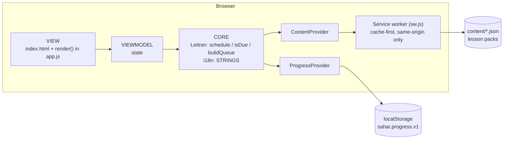
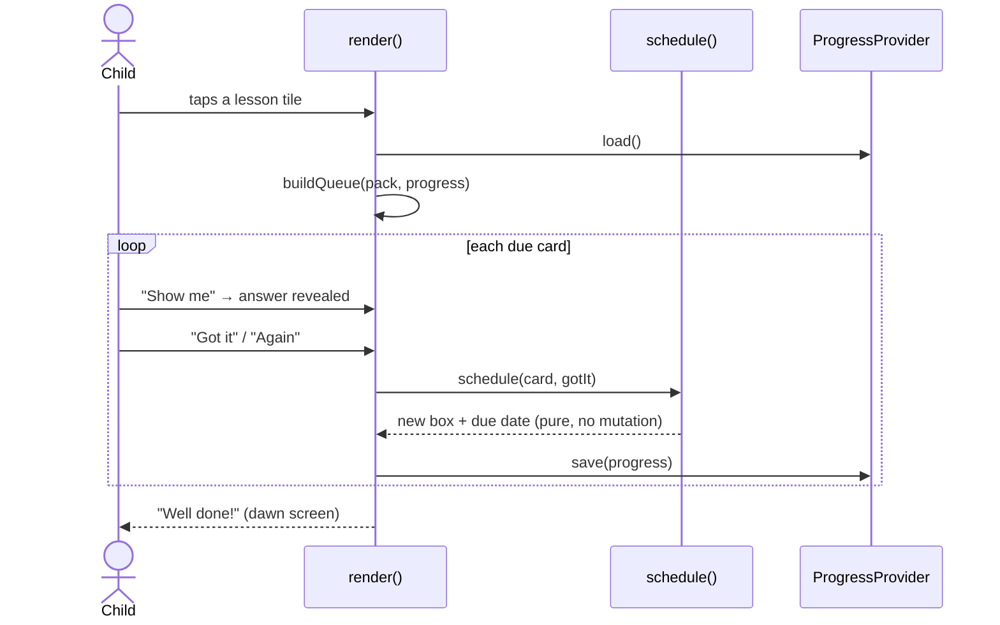
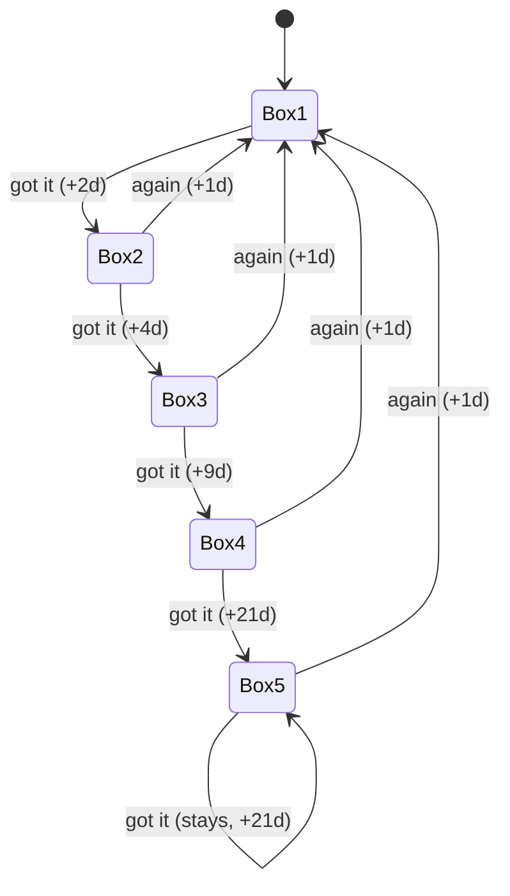

# Diagrams — the shape of Sahar

## Component map — who talks to whom

The view depends on the core; the core depends only on provider interfaces; nothing reaches an
external host, ever.

## Review flow — one card, one answer

## Card lifecycle — the Leitner state machine

A card climbs one box per correct answer and waits longer each time; a miss sends it back to box 1
for tomorrow.

